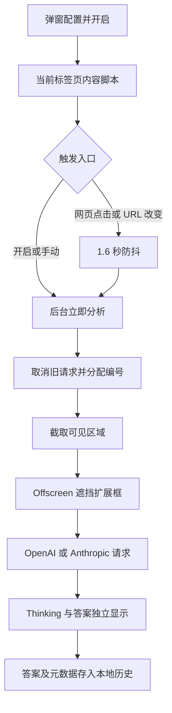
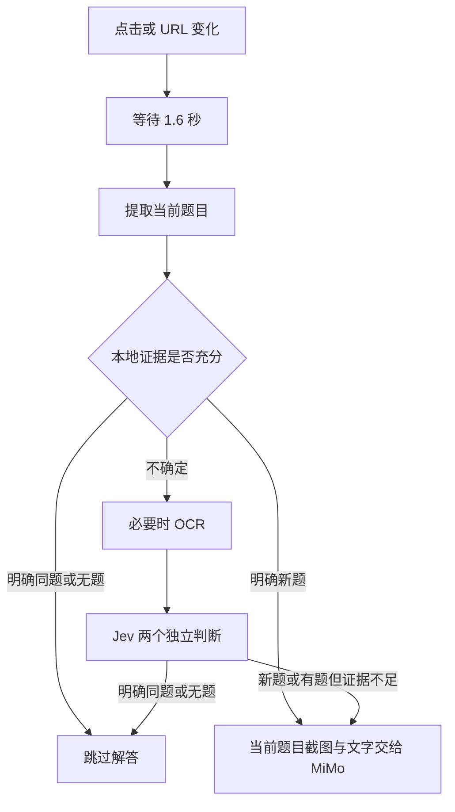

# Page Vision 整体设计

版本：1.7.0。现有实现和后续展望分别描述，展望不代表已实现或已通过实测。

## 目标与本次范围

用户查看当前题目，经配置的图片 API 得到规范流式答案，控制开启、关闭和立即分析。自动触发采用点击及 URL 变化后的 1.6 秒防抖。

本次仅升级当前题目提示词和文档，不新增 DOM 题目识别、Jev、OCR、答案缓存或收费调用。

## 现有架构



| 模块 | 职责 |
| --- | --- |
| `popup.js` | 配置、权限、开启与关闭 |
| `content.js` | 网页点击、防抖、分析框、过滤旧消息 |
| `worker.mjs` | 标签页生命周期、立即分析、截图、取消及历史 |
| `offscreen.js` | 图片解码、遮挡、PNG 编码 |
| `core.mjs` | 协议、地址、请求体、提示词和 SSE 解析 |
| `request.mjs` | 网络与流，不处理 DOM 或自动计时 |
| `history.mjs` | 顺序写入、数量/体积限制和字段白名单 |
| `history-page.js` | 历史展示、导出和清空 |

## 触发与并发规则

开启和手动分析立即执行；网页可信点击及 URL 改变先等待 1600ms，期间再触发就清除计时器重新计时。整页导航加载完成后恢复监听和计时。扩展框操作、合成点击、鼠标移动、滚动、输入、媒体和 DOM 自动变化不触发。

后台新分析递增编号并 abort 旧请求。连接、Thinking、Output 均可替换，旧编号不能修改当前显示。现有方案不判断同题，可能重复请求。

本地准备不含防抖；API 首字指答案首字，不是 Thinking 首字。120 秒超时覆盖发送后的请求阶段。取消客户端连接不保证服务端停止计费。

## 图片与答案范围

只截当前标签页可见区域。扩展框区域用灰色覆盖，不自动移走面板，也无法恢复被遮挡内容。

当前题目由图片模型依据明确题号、选中题号或题目区域判断。只有一道题则回答；多题无法定位则说明无法确定。不再要求从上到下逐题回答。四类题型保留对应格式。Thinking 独立展示，不保存到历史。

## 展望一：前端 DOM 题目识别

### 问题与页面适配

点击不能区分选项点击和换题，URL 可能只标识练习。应将点击与 URL 变化作为检查入口，以题目身份决定是否解答。

获得站点访问权限后，对比切题前后 DOM，确认题目容器、题号/ID、导航选中标记、题干、选项和题图。雨课堂具体选择器及切题机制尚未读取验证，不在文档中假设。

站点适配器 `extractCurrentQuestion()` 输出以下结构：

```json
{
  "status": "question",
  "questionId": "可选稳定标识",
  "number": "当前题号",
  "type": "single_choice",
  "stem": "题干原文",
  "options": [{"label": "A", "text": "选项原文"}],
  "images": [{"src": "题图标识", "alt": "可选说明"}],
  "rect": {"x": 0, "y": 0, "width": 600, "height": 400}
}
```

`status` 可为 `no_question`、`loading`、`unknown`。排除用户填写值、选中状态、计时器、导航和扩展输出。题号结合练习范围，不能把不同练习的第 1 题当作同题。

### 本地比较

稳定 ID 配合题干、选项和题图签名。规范化空白，不移除有意义的数字、否定词或公式。选项文字或顺序改变应使旧答案失效。图片 URL 相同不证明图像相同，需版本或内容指纹；无法证明一致时按不确定处理。

比较基准是上一次已接受分析的题目，不是任意读取结果。相同题目保留输出，明确新题解答，无题跳过，加载中暂缓提示。返回旧题只在练习范围和题目签名匹配时复用缓存。

### 验收

- 点击答案选项不重复解答。
- 同 URL 切题会识别新题。
- 仅 URL 改变但题目相同不重复解答。
- 导航、隐藏题目、填写答案和媒体不参与比较。
- 题图或选项改变不复用旧答案。
- 提取失败提示原因，并保留手动分析。

## 展望二：Jev 判断与按需 OCR

### Jev 的定位

Jev 只做语义判断，不解答。官方目前支持文本及结构化文本，不能直接看图；中文判断需在实际样例验证。[模型说明](https://docs.typesafe.ai/models)

调用 `POST https://api.typesafe.ai/v1/systemone`，初期 `jev-latest` 并记录返回版本，阈值校准后可固定版本。同次请求包含两个 Noul 问题：当前是否有待解答题目；假设存在题目，是否与上一次同题。Noul 返回“是”的概率，没有独立 confidence。[API 文档](https://docs.typesafe.ai/api)

本地无法明确判断时才调用。明确无题或同题跳过解答，明确新题解答；不能仅凭文字相同忽略题图变化。概率阈值需实际校准，不指定未经验证的准确率。

### OCR 的定位

DOM 有题干就不 OCR。文字嵌在图片中时，只裁剪当前题目做 OCR，将文字、顺序和置信度交给 Jev。几何图、曲线和示意图仍须交给 MiMo 看原图，OCR 不能替代图像理解。

| 候选服务 | 官方接口 | 用途 |
| --- | --- | --- |
| 腾讯云 | [GeneralAccurateOCR](https://cloud.tencent.com/document/api/866/34937) | Base64 转文字，返回位置和置信度 |
| 百度 | [accurate_basic](https://aca.bce.baidu.com/doc/OCR/s/1k3h7y3db) | 通用文字高精度识别 |
| 阿里云 | [RecognizeAdvanced](https://api.alibabacloud.com/document/ocr-api/2021-07-07/RecognizeAdvanced) | 高精度全文识别 |

尚未选择供应商、申请 OCR 凭据或调用接口。先验证认证、费用、延迟、中文与公式效果，避免去重比直接解答更昂贵。

### 未来流程



新点击使旧判断失效。未来只有决定解答新题才替换 MiMo，同题点击不取消正在输出的答案。服务失败显示阶段与原因，不无限重试或静默增加收费调用。

### 实施顺序

1. 新增 `question.mjs` 和站点适配器，先完成准确提取、本地去重。
2. 新增 `gate.mjs`，接入 TypeSafe、概率记录、超时及过期过滤。
3. 新增 `ocr.mjs`，仅处理无可靠 DOM 文本的文字图片。
4. 弹窗增加独立配置及开关，密钥不进入网页 DOM、源码、日志或公开示例。
5. 展示读取、OCR、判断、跳过、解答阶段，测延迟、费用、漏题率和重复请求率。

开发默认模拟 API，真实收费测试另行限定样例与次数。先发布当前提示词版本，再分阶段落实两项展望。
